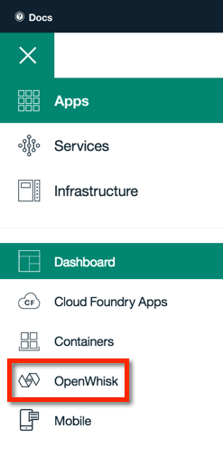
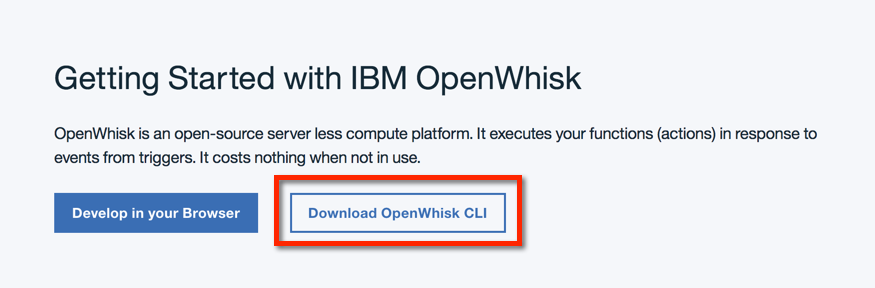
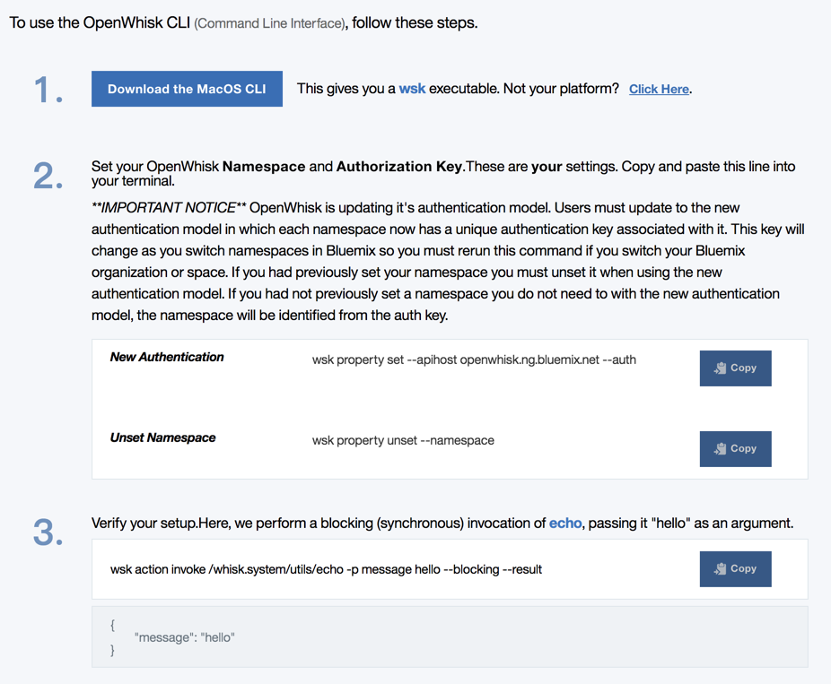

# OpenWhisk 101 - Sample Application Template
This project provides sample code for creating an application with Apache OpenWhisk on IBM Bluemix. It should take no more than 10 minutes to get up and running. Once you complete this sample application, you can move on to more complex serverless application use cases, such as those named _OpenWhisk 201_ or tagged as [_openwhisk-use-cases_](https://github.com/search?q=topic%3Aopenwhisk-use-cases+org%3AIBM&type=Repositories).

# Overview of sample application (image)
To come.

## Flow of create, read, update, delete calls
1. The first step.
2. The second step.
3. The third step.
4. The fourth step.

# Installation
Setting up this sample involves configuration of OpenWhisk and supporting services on IBM Bluemix. Let's briefly review each of them.

## Sign up for a Bluemix account
Begin by going to [bluemix.net](https://console.ng.bluemix.net/) and signing up for a free account. After you activate your account, set an organization (for example, _MyACMEorg_) and space (for example _test_), click on OpenWhisk in the left navigation. 

## Install, configure, and test the OpenWhisk CLI
Once there, click the "Download OpenWhisk CLI" button. 

Then, follow the three steps to install, configure, and test connectivity. Note that the authorization key is not shown here. 

### Set up supporting service
To come.

## Execute `deploy` to deploy the sample
Clone this repository to your system, and change to the root directory and install the app using `deploy.sh`

This will be adjusted soon to use ['wskdeploy'](https://github.com/openwhisk/openwhisk-wskdeploy) tool, which uses a manifest to create the triggers, actions, and rules that power the sample.

```bash
./deploy.sh --install
```

## Confirm that everything works
To come

## Troubleshooting
The first place to check for errors is the OpenWhisk activation log. You can view it by tailing the log on the command line with `wsk activation poll` or you can view the [monitoring console on Bluemix](https://console.ng.bluemix.net/openwhisk/dashboard).

# Credits
To come.

# License
Licensed under the [Apache 2.0 license](LICENSE.txt).
